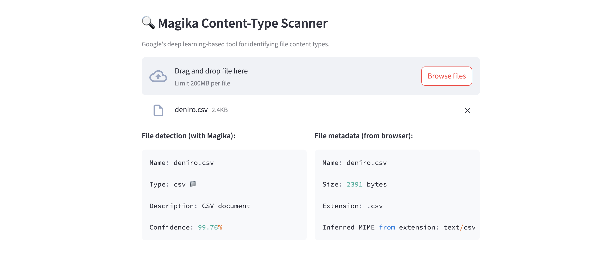

# magika
Magika is an [open-source](https://github.com/google/magika) content type detection tool by Google, employing a custom, highly optimized deep-learning model that enables precise file identification within milliseconds. This repository showcases a simple Streamlit app that leverages the [Magika Python library](https://github.com/google/magika/blob/main/python/DOCS.md) for file classification.

